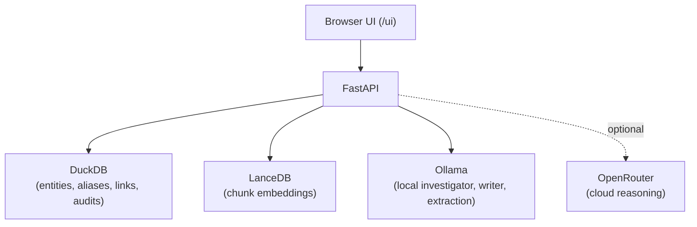
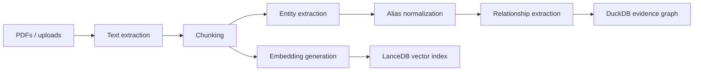
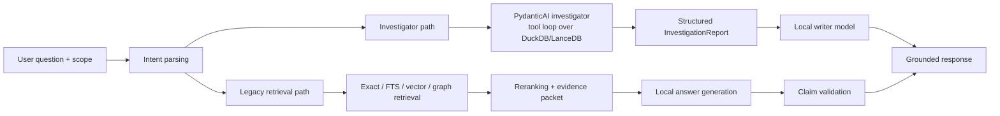

# Operation Lens v2

> **Turn a folder of PDFs into a searchable, evidence-backed intelligence graph — entirely on your own machine.**

Operation Lens v2 is a local-first platform for PDF intelligence analysis. It ingests documents,
extracts entities and relationships, and answers investigator-style questions with every claim
validated against a cited source span. By default, no document content ever leaves the machine.

- **Primary repo:** [meabs/localsearch](https://github.com/meabs/localsearch)
- **Architecture notes:** [docs/architecture.md](docs/architecture.md)
- **Runbook:** [docs/runbook.md](docs/runbook.md)
- **License:** PolyForm Noncommercial 1.0.0 (see [LICENSE](LICENSE) and [COMMERCIAL-LICENSE.md](COMMERCIAL-LICENSE.md))

---

## Quickstart (5 minutes)

```powershell
# 1. Clone and enter the repo
git clone https://github.com/meabs/localsearch.git
cd localsearch

# 2. Create a virtual environment and install
python -m venv .venv
.\.venv\Scripts\Activate.ps1
pip install -e .[dev]

# 3. Copy the example config
Copy-Item config/.env.example config/.env

# 4. Start Ollama in another terminal (if using local models)
ollama serve

# 5. Run the API
uvicorn operation_lens_v2.api.main:app --reload
```

Then open **http://127.0.0.1:8000/ui**.

> On macOS / Linux, replace the PowerShell commands with their shell equivalents
> (`source .venv/bin/activate`, `cp`, etc.).

---

## Table of Contents

1. [What it does](#what-it-does)
2. [Architecture at a glance](#architecture-at-a-glance)
3. [Prerequisites](#prerequisites)
4. [Installation and setup](#installation-and-setup)
5. [Typical workflow](#typical-workflow)
6. [Configuration reference](#configuration-reference)
7. [Extending the system](#extending-the-system)
8. [Project layout](#project-layout)
9. [Testing and quality](#testing-and-quality)
10. [Troubleshooting](#troubleshooting)
11. [Documentation and further reading](#documentation-and-further-reading)

---

## What it does

**Ingestion:** PDFs → text extraction → chunking → NER → alias normalization → relationship
extraction → DuckDB evidence graph + LanceDB vector index.

**Query:** question → scope selection (document / case / corpus) → intent parsing → either the
investigator agent or the legacy retrieval path → grounded briefing with citations.

### Main capabilities

| Capability | Description |
|---|---|
| PDF ingestion | API + browser upload, with case grouping |
| Hybrid retrieval | Exact, full-text, vector, and graph search combined |
| Evidence-backed answers | Every claim validated against a source span |
| Timeline view | Chronological events extracted from dated passages |
| Entity network | Graph view of people, places, vehicles, orgs |
| Attachments | Upload files against entities |
| Geocoding | Optional Nominatim lookups for locations |
| Audit trail | Every query + answer persisted for review |
| Browser UI | Served at `/ui`, no separate build step |
| Investigator agent | Tool-using local agent for deeper corpus investigation |

---

## Architecture at a glance



<details>
<summary><b>Ingestion flow</b></summary>


</details>

<details>
<summary><b>Query flow</b></summary>


</details>

**Data sovereignty:** DuckDB + LanceDB + Ollama all run on the local machine. OpenRouter is only
used when explicitly requested, and span text is redacted before any external call.

---

## Prerequisites

| | Requirement |
|---|---|
| Python | 3.11 or newer |
| Ollama | Installed and running locally (for the default local pipeline) |
| Disk | Enough free space for `data/` artifacts (databases + vector index) |
| OpenRouter API key | **Only** if you want optional cloud reasoning |

Recommended Ollama models (override in `config/.env` to match what you have):

- Local reasoning: `deepseek-r1:latest`
- Investigator: `deepseek-r1:latest`
- Writer: `deepseek-r1:latest`
- Critic / extraction: `llama3.1:8b-instruct-q4_K_M`
- Embedding: `nomic-embed-text`

---

## Installation and setup

### 1. Virtual environment

```powershell
python -m venv .venv
.\.venv\Scripts\Activate.ps1
```

### 2. Install

```powershell
pip install -e .[dev]
```

### 3. Configure

```powershell
Copy-Item config/.env.example config/.env
```

Edit `config/.env` to match the models and paths on your machine.

> **Never commit `config/.env`.** Keep `OPENROUTER_API_KEY` blank unless you actively need cloud
> reasoning. If a real key leaks into a commit, rotate it immediately.

### 4. Confirm Ollama

```powershell
ollama list          # models listed in config/.env must appear here
ollama serve         # leave running in a separate terminal
```

### 5. Run

```powershell
uvicorn operation_lens_v2.api.main:app --reload
```

Open **http://127.0.0.1:8000/ui**.

---

## Typical workflow

### Create a case

```powershell
curl -X POST http://127.0.0.1:8000/cases `
  -H "Content-Type: application/json" `
  -d '{"case_ref":"OP_TEST","case_name":"Test Case"}'
```

### Ingest a single PDF

```powershell
curl -X POST http://127.0.0.1:8000/ingest/file `
  -H "Content-Type: application/json" `
  -d '{"pdf_path":"data/pdfs/sample.pdf","case_ref":"OP_TEST"}'
```

### Ingest a folder with the helper

Drop PDFs into `data/pdfs/` then run:

```powershell
.\.venv\Scripts\python scripts\ingest_cases.py
```

<details>
<summary>What the helper does</summary>

- Sends every `data/pdfs/*.pdf` file to `http://127.0.0.1:8000/ingest`
- Infers `case_ref` from the filename prefix:
  - `NF-*` → `OP_NIGHTFALL`
  - `OC-*` → `OP_CHESTER`
  - `OP_IRONVALE*` → `OP_IRONVALE`
  - `OP_SEAGLASS*` → `OP_SEAGLASS`
  - anything else → `UNASSIGNED`
- Reads only top-level files under `data/pdfs` (no recursion)
- Set `INGEST_FORCE=true` to re-ingest already-indexed files:

  ```powershell
  $env:INGEST_FORCE="true"
  .\.venv\Scripts\python scripts\ingest_cases.py
  ```
</details>

### Ask a question

```powershell
curl -X POST http://127.0.0.1:8000/query `
  -H "Content-Type: application/json" `
  -d '{"query":"What locations is Marcus Webb connected to?","case_ref":"OP_TEST"}'
```

### Review audit history

```powershell
curl http://127.0.0.1:8000/audit/queries
```

### Useful endpoints

| Method | Path | Purpose |
|---|---|---|
| GET | `/health` | Liveness check |
| POST | `/ingest/file` | Ingest a single PDF by path |
| POST | `/ingest/corpus` | Ingest a whole folder |
| POST | `/ingest/upload` | Upload + ingest via browser |
| POST | `/query` | Ask a question |
| GET | `/query/templates` | Saved query templates |
| GET/POST | `/cases` | List / create cases |
| GET | `/timeline` | Chronological events |
| GET | `/graph/network` | Entity graph JSON |
| GET | `/audit/queries` | Query history |

---

## Configuration reference

The app loads settings from `config/.env`. Full defaults live in
[`src/operation_lens_v2/config.py`](src/operation_lens_v2/config.py).

<details>
<summary><b>Application and storage</b></summary>

| Variable | Purpose |
|---|---|
| `APP_ENV` | Runtime label, e.g. `dev` |
| `LOG_LEVEL` | Logging verbosity |
| `DUCKDB_PATH` | Main DuckDB database |
| `LANCEDB_PATH` | LanceDB embedding store |
| `PDF_ROOT` | Root folder for uploaded and case-scoped PDFs |
</details>

<details>
<summary><b>Local models (Ollama)</b></summary>

| Variable | Purpose |
|---|---|
| `OLLAMA_BASE_URL` | Base URL for the local Ollama server |
| `OLLAMA_TIMEOUT` | Timeout for Ollama calls |
| `LOCAL_REASONING_MODEL` | Legacy local answer generation |
| `INVESTIGATOR_MODEL` | Local tool-using investigator agent |
| `WRITER_MODEL` | Local narrative briefing writer |
| `CRITIC_MODEL` | Local lightweight critic / structured extraction helper |
| `LOCAL_EXTRACTION_MODEL` | Claim extraction + relationship / entity tasks |
| `LOCAL_EMBED_MODEL` | Embeddings |
</details>

<details>
<summary><b>Retrieval and chunking</b></summary>

`VECTOR_TOP_K`, `FTS_TOP_K`, `GRAPH_MAX_HOPS`, `RERANK_TOP_N`, `MAX_EVIDENCE_TOKENS`,
`CHUNK_TARGET_TOKENS`, `CHUNK_MAX_TOKENS`, `CHUNK_OVERLAP_TOKENS`, `CHUNK_MIN_TOKENS`.
</details>

<details>
<summary><b>Entity and relationship tuning</b></summary>

`ALIAS_THRESHOLD`, `PATTERN_CONFIDENCE`, `LLM_CONFIDENCE_MIN`, `LLM_CONFIDENCE_MAX`,
`COOCCURRENCE_CONFIDENCE`.
</details>

<details>
<summary><b>Geocoding (optional)</b></summary>

`GEOCODING_ENABLED`, `NOMINATIM_BASE_URL`, `NOMINATIM_USER_AGENT`, `NOMINATIM_COUNTRY_BIAS`,
`NOMINATIM_MIN_INTERVAL`.
</details>

<details>
<summary><b>Cloud reasoning (optional, off by default)</b></summary>

| Variable | Purpose |
|---|---|
| `ALLOW_CLOUD_REASONING` | Master switch; leave `false` to stay fully local |
| `OPENROUTER_API_KEY` | Required for OpenRouter use |
| `OPENROUTER_BASE_URL` | Endpoint |
| `OPENROUTER_MODEL` | Cloud model ID |
| `PREFER_OPENROUTER_OUTPUT` | Keep `false` to prefer local Ollama output |

OpenRouter is disabled by default and only used when a request explicitly enables cloud reasoning.
Span text is redacted before any OpenRouter call.
</details>

---

## Extending the system

The biggest extension point is [`config/entity_schema.json`](config/entity_schema.json) — a dynamic
registry that lets you change extraction behaviour without touching Python.

<details>
<summary><b>What <code>entity_schema.json</code> controls</b></summary>

- Which entity types exist
- GLiNER prompts per entity type
- LLM alias labels that map back to canonical types
- Normalization strategy per type
- Regex extractors for types like phone, plate, date, email, account
- UI colour per entity type
- Preferred relation labels
- Deterministic relationship patterns (run before the LLM fallback)

**Three sections:**

- **`entity_types`** — canonical registry (`PERSON`, `ORGANISATION`, `LOCATION`, `PHONE`,
  `VEHICLE`, `CASE_REF`, `DATE`, `EMAIL`, `IP_ADDRESS`, `WEAPON`, `DRUG`, `BANK_ACCOUNT`,
  `SERIAL`). Each can define `gliner_prompts`, `llm_aliases`, `color`, `normalise`, and `regex`.
- **`relation_hints`** — preferred relation labels (`OBSERVED_AT`, `ASSOCIATED_WITH`,
  `LINKED_TO`, `MENTIONED_WITH`, `INFERRED_LINK`). Biases extraction toward consistent labels.
- **`relation_patterns`** — deterministic regex patterns that produce structured relationships
  before the LLM fallback runs.

**Use it to:**

- Add a new entity type
- Teach the system new aliases
- Add a regex for a domain-specific identifier
- Change normalization behaviour
- Refine deterministic relationship patterns
- Alter how entity types appear in the UI
</details>

To adapt to a new domain, start with `entity_schema.json`, then extend the ingestion or query
packages under `src/operation_lens_v2/` only if the schema can't express what you need.

---

## Project layout

```
src/operation_lens_v2/
├── api/              FastAPI app, routes, request/response models
│   └── routes/       ingest, query, graph, cases, timeline, audit
├── ingestion/        PDF extraction, chunking, NER, normalization, persistence
├── query/            parser, scope, tools, investigator, writer, retrieval, validation
├── services/         geocoder and other optional services
├── frontend/         browser UI served at /ui
├── runtime.py        shared resources (DuckDB, vector store, HTTP clients)
└── config.py         authoritative env-var reference + defaults
config/
├── .env.example      copy to .env, edit locally
└── entity_schema.json  dynamic extraction registry (main extension point)
docs/
├── architecture.md   architecture notes
└── runbook.md        operating runbook
scripts/              ingestion helpers + demo-corpus generators
tests/                unit + integration coverage
```

<details>
<summary><b>Core files</b></summary>

- `pyproject.toml` — package metadata, dependencies, Ruff + pytest config
- `LICENSE` — PolyForm Noncommercial 1.0.0
- `COMMERCIAL-LICENSE.md` — commercial-use + attribution guidance
- `start_server.bat` / `start_static.bat` — Windows launch helpers
- `.gitignore` — keeps databases, caches, attachments, build outputs untracked
</details>

---

## Testing and quality

```powershell
python -m ruff check .
python -m pytest
```

Build a wheel locally:

```powershell
python -m pip wheel . --no-deps -w .tmp_wheels
```

---

## Troubleshooting

<details>
<summary>The server starts but queries fail</summary>

- Ollama is running (`ollama serve`)
- Models in `config/.env` exist in `ollama list`
- `DUCKDB_PATH` and `LANCEDB_PATH` point to valid paths
</details>

<details>
<summary>Ingestion works but semantic search is weak</summary>

- Embedding model matches the vector index you built (changing `LOCAL_EMBED_MODEL` after ingest
  invalidates the index)
- No stale data from a previous config is being reused
- `LANCEDB_PATH` points to the expected index
</details>

<details>
<summary>Geocoding errors</summary>

- `GEOCODING_ENABLED=true`
- The machine can reach `NOMINATIM_BASE_URL`
- `NOMINATIM_USER_AGENT` is set
</details>

<details>
<summary>Disable cloud reasoning</summary>

```text
ALLOW_CLOUD_REASONING=false
```

Cloud reasoning is off by default.
</details>

---

## Documentation and further reading

All long-form docs live under [`docs/`](docs/) and are rendered on GitHub:

- [Architecture](docs/architecture.md) — data stores and pipeline shape
- [Runbook](docs/runbook.md) — operating notes

Source of truth for environment variables and tunables:
[`src/operation_lens_v2/config.py`](src/operation_lens_v2/config.py).

> **Hosted site:** a Jekyll landing page is already scaffolded in [`docs/index.md`](docs/index.md)
> with [`docs/_config.yml`](docs/_config.yml). Enable it via **Settings → Pages → Source: Deploy
> from a branch → Branch: `main` / Folder: `/docs`**. GitHub will publish it at
> `https://meabs.github.io/localsearch/`.

### Repo hygiene

- `config/.env` stays local-only
- Databases, vector stores, attachments, caches, and build outputs stay untracked
- Local note files (`Claude.md`, `linkedin.md`, etc.) are ignored

---

## License

Released under **PolyForm Noncommercial 1.0.0**.

- Noncommercial use is permitted under the public license
- Commercial use requires a separate written license

See [LICENSE](LICENSE) and [COMMERCIAL-LICENSE.md](COMMERCIAL-LICENSE.md).
