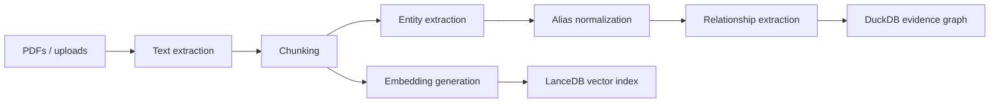
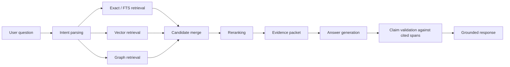
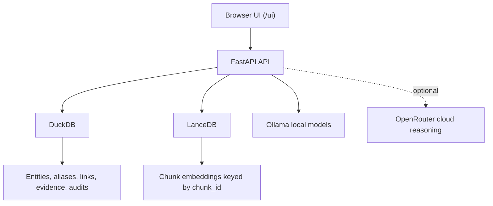

# Operation Lens v2

Operation Lens v2 is a local-first, evidence-driven intelligence analysis platform for ingesting PDFs,
extracting entities and relationships, and answering investigator-style questions with cited evidence.

Primary repository:

- [meabs/localsearch](https://github.com/meabs/localsearch.git)

The project is designed to keep the core workflow on-device:

- DuckDB stores structured evidence, entities, aliases, relationships, and query history.
- LanceDB stores vector embeddings keyed by `chunk_id`.
- Local models served through Ollama handle embedding, extraction, and reasoning by default.
- Cloud reasoning is optional and disabled by default.

## What The Project Does

Operation Lens turns a folder of PDFs into a searchable evidence graph.

The ingestion pipeline:

1. extracts text from PDFs
2. chunks the text into retrievable passages
3. runs named entity extraction
4. normalizes aliases into canonical entities
5. extracts typed relationships between entities
6. persists both structured evidence and embeddings locally

The query pipeline:

1. parses the question intent
2. retrieves evidence using exact match, full-text, vector, and graph retrieval
3. reranks the combined candidates
4. builds an evidence packet
5. generates an answer
6. validates claims against cited evidence spans

## Key Flows

### Ingestion flow



### Query flow



### Runtime architecture



## Main Capabilities

- PDF ingestion through API and browser upload
- Case management for grouping evidence under case references
- Exact, full-text, vector, and graph retrieval
- Timeline extraction from dated passages
- Entity network and investigator profile views
- Attachment uploads for entities
- Optional geocoding for location entities
- Query audit history via API
- Browser UI served from `/ui`

## Architecture At A Glance

- `DuckDB` is the source of truth for documents, chunks, entities, aliases, relationships, evidence, and audits.
- `LanceDB` stores embeddings for semantic search.
- `FastAPI` serves the REST API and static UI.
- `Ollama` provides the local embedding, extraction, and reasoning models.
- `OpenRouter` can be enabled for cloud reasoning, but is optional.

## Prerequisites

Before starting, make sure you have:

- Python `3.11` or newer
- `pip`
- Ollama installed and running locally if you want local embedding/extraction/reasoning
- enough disk space for `data/` artifacts
- an OpenRouter API key only if you want optional cloud reasoning

Recommended:

- Windows PowerShell for the commands below
- a clean virtual environment per checkout

## Key Files And Folders

### Core project files

- `pyproject.toml`
  Python package metadata, dependencies, Ruff config, and pytest config.
- `README.md`
  Project overview, setup, and operating notes.
- `LICENSE`
  Public noncommercial software license for this repository.
- `COMMERCIAL-LICENSE.md`
  Commercial-use and attribution guidance.
- `.gitignore`
  Keeps local databases, caches, attachments, and build outputs out of Git.

### Configuration

- `config/.env.example`
  Example environment file you can copy to `config/.env`.
- `config/.env`
  Local runtime settings loaded by the app.
- `config/entity_schema.json`
  Dynamic registry for entity types, relation hints, regex rules, and UI colors.
- [`src/operation_lens_v2/config.py`](C:/Users/meaburn/code/datagraph/src/operation_lens_v2/config.py)
  Authoritative list of supported environment variables and default values.

## What `config/entity_schema.json` Does

[`config/entity_schema.json`](C:/Users/meaburn/code/datagraph/config/entity_schema.json) is the
project's dynamic extraction registry. It lets you change the kinds of entities and relationship
patterns the system understands without editing Python code.

In practice, this file controls:

- which entity types exist
- which GLiNER prompts are used for each entity type
- which alias labels from LLM output map back to each canonical entity type
- which normalization strategy is applied to each type
- which regex extractors run for types like phone numbers, plates, dates, emails, and account data
- which UI color is used for each entity type
- which relation labels the system prefers
- which deterministic relationship patterns are recognized before the LLM fallback runs

The file has three main sections:

### `entity_types`

This is the registry of canonical entity types such as:

- `PERSON`
- `ORGANISATION`
- `LOCATION`
- `PHONE`
- `VEHICLE`
- `CASE_REF`
- `DATE`
- `EMAIL`
- `IP_ADDRESS`
- `WEAPON`
- `DRUG`
- `BANK_ACCOUNT`
- `SERIAL`

For each type, the schema can define:

- `gliner_prompts`
  Labels used to guide GLiNER extraction.
- `llm_aliases`
  Alternative labels that local LLM extraction may emit.
- `color`
  UI color used in graph and schema responses.
- `normalise`
  The normalization strategy for canonicalizing values.
- `regex`
  Optional pattern-based extractor for deterministic matching.

Examples:

- `PERSON` strips titles like `DC`, `DS`, and `Dr` during normalization.
- `LOCATION` expands abbreviations such as `Rd` to `Road`.
- `PHONE`, `VEHICLE`, `EMAIL`, and `BANK_ACCOUNT` all have regex-driven extraction support.

### `relation_hints`

This is the shortlist of preferred relation labels used to steer relationship extraction, such as:

- `OBSERVED_AT`
- `ASSOCIATED_WITH`
- `LINKED_TO`
- `MENTIONED_WITH`
- `INFERRED_LINK`

These do not hard-lock the system to a tiny enum, but they do bias extraction toward consistent
labels.

### `relation_patterns`

This is the deterministic relationship layer. Each entry contains:

- a name
- a regex pattern
- a relation type
- optional regex flags

These patterns run before LLM fallback, which means common formulations like "was observed at" or
"is associated with" can be turned into structured relationships quickly and reproducibly.

### Why this file matters

If you want to adapt the project to a different domain, this is one of the first files to edit.

You can use it to:

- add a new entity type
- teach the system new aliases
- add a regex extractor for a domain-specific identifier
- change normalization behavior
- add or refine deterministic relationship patterns
- alter how entity types appear in the UI

That makes `entity_schema.json` one of the core extension points for the whole repository.

### Application entrypoints

- [`src/operation_lens_v2/api/main.py`](C:/Users/meaburn/code/datagraph/src/operation_lens_v2/api/main.py)
  FastAPI app entrypoint and route registration.
- `start_server.bat`
  Convenience script to run the backend.
- `start_static.bat`
  Convenience script for static serving if you use it in your workflow.

### API route modules

- `src/operation_lens_v2/api/routes/ingest.py`
  File and corpus ingestion endpoints.
- `src/operation_lens_v2/api/routes/query.py`
  Query endpoint and saved query templates.
- `src/operation_lens_v2/api/routes/graph.py`
  Entity graph, profiles, attachments, geocoding, and vehicle tracks.
- `src/operation_lens_v2/api/routes/cases.py`
  Case creation and case document listing.
- `src/operation_lens_v2/api/routes/timeline.py`
  Chronological event extraction from chunk text.
- `src/operation_lens_v2/api/routes/audit.py`
  Query history and audit endpoints.

### Core pipeline packages

- `src/operation_lens_v2/ingestion/`
  PDF extraction, chunking, NER, normalization, relationship extraction, and persistence.
- `src/operation_lens_v2/query/`
  Query parsing, retrieval, reranking, evidence building, answer generation, and claim validation.
- `src/operation_lens_v2/services/geocoder.py`
  Optional Nominatim-backed geocoding service.
- `src/operation_lens_v2/runtime.py`
  Shared runtime resources such as cached DuckDB connections, vector stores, and HTTP clients.

### UI and docs

- `src/operation_lens_v2/frontend/`
  Browser UI assets served at `/ui`.
- `docs/architecture.md`
  Short architecture notes.
- `docs/runbook.md`
  Basic operating runbook.
- `tests/`
  Unit and integration coverage.

## Configuration Overview

The app loads settings from `config/.env`. The easiest way to start is to copy the example:

```powershell
Copy-Item config/.env.example config/.env
```

The most important settings are:

### Application and storage

- `APP_ENV`
  Runtime label such as `dev`.
- `LOG_LEVEL`
  Logging verbosity.
- `DUCKDB_PATH`
  Path to the main DuckDB database.
- `LANCEDB_PATH`
  Path to the LanceDB embedding store.
- `PDF_ROOT`
  Root folder for uploaded and case-scoped PDFs.

### Local model configuration

- `OLLAMA_BASE_URL`
  Base URL for the local Ollama server.
- `OLLAMA_TIMEOUT`
  Timeout used for Ollama calls.
- `LOCAL_REASONING_MODEL`
  Model used for answer generation.
- `LOCAL_EXTRACTION_MODEL`
  Model used for claim extraction and relationship/entity-related extraction tasks.
- `LOCAL_EMBED_MODEL`
  Model used to create embeddings.

### Retrieval and chunking

- `VECTOR_TOP_K`
- `FTS_TOP_K`
- `GRAPH_MAX_HOPS`
- `RERANK_TOP_N`
- `MAX_EVIDENCE_TOKENS`
- `CHUNK_TARGET_TOKENS`
- `CHUNK_MAX_TOKENS`
- `CHUNK_OVERLAP_TOKENS`
- `CHUNK_MIN_TOKENS`

### Entity and relationship tuning

- `ALIAS_THRESHOLD`
- `PATTERN_CONFIDENCE`
- `LLM_CONFIDENCE_MIN`
- `LLM_CONFIDENCE_MAX`
- `COOCCURRENCE_CONFIDENCE`

### Geocoding

- `GEOCODING_ENABLED`
  Enable or disable Nominatim lookups.
- `NOMINATIM_BASE_URL`
- `NOMINATIM_USER_AGENT`
- `NOMINATIM_COUNTRY_BIAS`
- `NOMINATIM_MIN_INTERVAL`

### Optional cloud reasoning

- `ALLOW_CLOUD_REASONING`
  Enables cloud reasoning support when a request asks for it.
- `OPENROUTER_API_KEY`
  Required for OpenRouter use.
- `OPENROUTER_BASE_URL`
- `OPENROUTER_MODEL`
- `PREFER_OPENROUTER_OUTPUT`

## Getting It Working

### 1. Create a virtual environment

```powershell
python -m venv .venv
.\.venv\Scripts\Activate.ps1
```

### 2. Install dependencies

```powershell
pip install -e .[dev]
```

### 3. Create your local config

```powershell
Copy-Item config/.env.example config/.env
```

Then edit `config/.env` to match the models and paths on your machine.

Important:

- do not commit `config/.env`
- keep `OPENROUTER_API_KEY` blank unless you actively need cloud reasoning
- if you accidentally committed a real API key anywhere, rotate it immediately

### 4. Make sure Ollama is running

If you want the full local pipeline, start Ollama and confirm the models in `config/.env` exist in
`ollama list`.

If your local model names differ from the example values, update:

- `LOCAL_REASONING_MODEL`
- `LOCAL_EXTRACTION_MODEL`
- `LOCAL_EMBED_MODEL`

### 5. Start the API

```powershell
uvicorn operation_lens_v2.api.main:app --reload
```

### 6. Open the UI

Open:

- `http://127.0.0.1:8000/ui`

Useful backend endpoints:

- `GET /health`
- `POST /ingest/file`
- `POST /ingest/corpus`
- `POST /ingest/upload`
- `POST /query`
- `GET /query/templates`
- `GET /cases`
- `POST /cases`
- `GET /timeline`
- `GET /audit/queries`
- `GET /graph/network`

## Typical Local Workflow

### Create a case

Use the UI or:

```powershell
curl -X POST http://127.0.0.1:8000/cases `
  -H "Content-Type: application/json" `
  -d '{"case_ref":"OP_TEST","case_name":"Test Case"}'
```

### Ingest one PDF

```powershell
curl -X POST http://127.0.0.1:8000/ingest/file `
  -H "Content-Type: application/json" `
  -d '{"pdf_path":"data/pdfs/sample.pdf","case_ref":"OP_TEST"}'
```

### Ask a question

```powershell
curl -X POST http://127.0.0.1:8000/query `
  -H "Content-Type: application/json" `
  -d '{"query":"What locations is Marcus Webb connected to?","case_ref":"OP_TEST"}'
```

### Review audit history

```powershell
curl http://127.0.0.1:8000/audit/queries
```

## Data And Runtime Notes

- The app creates local artifacts in `data/`.
- `DuckDB` is the main structured store.
- `LanceDB` stores embeddings for semantic retrieval.
- Uploaded attachments are stored under `data/attachments/`.
- The repo `.gitignore` is configured to avoid committing these generated artifacts.

## Repository Hygiene

For the GitHub repo at [meabs/localsearch](https://github.com/meabs/localsearch.git):

- `config/.env` should stay local-only
- local databases, vector stores, attachments, caches, and build outputs should stay untracked
- local note files like `Claude.md` and `linkedin.md` are ignored and should not be included in a
  release-oriented commit

## Testing And Quality Checks

Run the standard local checks:

```powershell
python -m ruff check .
python -m pytest
```

Build a wheel locally:

```powershell
python -m pip wheel . --no-deps -w .tmp_wheels
```

## Troubleshooting

### The server starts but queries fail

Check:

- Ollama is running
- the configured local model names exist
- `config/.env` points to valid paths

### Ingestion works but semantic search seems weak

Check:

- your embedding model matches the vector index you built
- you are not reusing stale data from a previous config
- `LANCEDB_PATH` is the index you expect

### Geocoding errors appear

Check:

- `GEOCODING_ENABLED=true`
- the machine can reach the configured Nominatim endpoint
- `NOMINATIM_USER_AGENT` is set appropriately

### You want cloud reasoning disabled

Set:

```text
ALLOW_CLOUD_REASONING=false
```

Cloud reasoning is optional and off by default.

## License

This repository is released under `PolyForm Noncommercial 1.0.0`.

- Noncommercial use is permitted under the public license.
- Commercial use requires a separate written license from the licensor.
- See [LICENSE](C:/Users/meaburn/code/datagraph/LICENSE) and
  [COMMERCIAL-LICENSE.md](C:/Users/meaburn/code/datagraph/COMMERCIAL-LICENSE.md).
