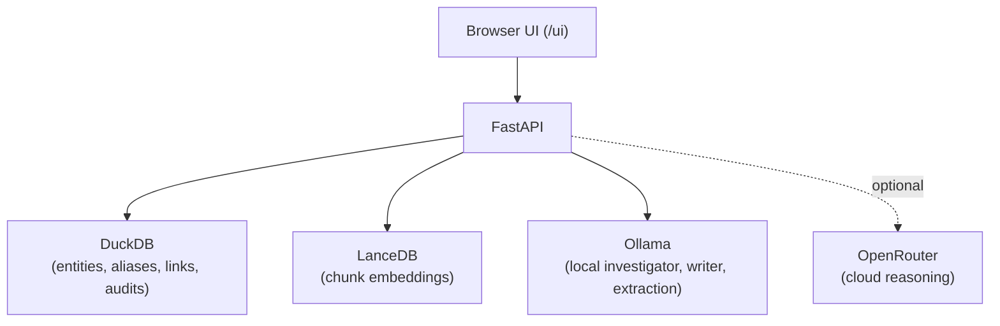
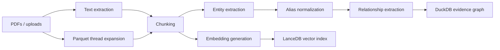
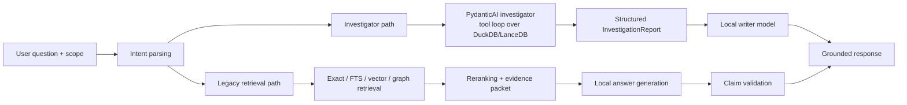

# Operation Lens v2

> **Turn PDFs or structured email-thread Parquet files into a searchable, evidence-backed intelligence graph on your own machine.**

Operation Lens v2 is a local-first evidence intelligence platform. It ingests PDFs and structured
email-thread Parquet files, extracts entities and relationships, and answers investigator-style
questions with every claim validated against a cited source span. By default, no document content
ever leaves the machine.

- **Primary repo:** [meabs/localsearch](https://github.com/meabs/localsearch)
- **Architecture notes:** [docs/architecture.md](docs/architecture.md)
- **Runbook:** [docs/runbook.md](docs/runbook.md)
- **License:** PolyForm Noncommercial 1.0.0

---

## Quickstart

```powershell
git clone https://github.com/meabs/localsearch.git
cd localsearch

python -m venv .venv
.\.venv\Scripts\Activate.ps1
pip install -e .[dev]

Copy-Item config/.env.example config/.env
ollama serve
uvicorn operation_lens_v2.api.main:app --reload
```

Open [http://127.0.0.1:8000/ui](http://127.0.0.1:8000/ui).

---

## What It Does

**Ingestion**

- PDFs go through text extraction, chunking, entity extraction, alias normalization, relationship extraction, DuckDB graph persistence, and LanceDB embedding generation.
- Email-thread Parquet files go through thread expansion, message chunking, identity normalization, `EMAILED` edge generation, DuckDB graph persistence, and LanceDB embedding generation.

**Query**

- Questions are scoped to `document`, `case`, or `corpus`.
- The system routes to either the investigator path or the legacy retrieval path.
- Responses stay grounded in stored evidence and citations.

### Main capabilities

| Capability | Description |
|---|---|
| PDF ingestion | API + browser upload, with case grouping |
| Email-thread Parquet ingestion | API + browser upload for `.parquet` thread exports |
| Hybrid retrieval | Exact, full-text, vector, and graph search combined |
| Evidence-backed answers | Every claim validated against a source span |
| Timeline view | Chronological events extracted from dated passages |
| Entity network | Graph view of people, places, vehicles, orgs |
| Attachments | Upload files against entities |
| Geocoding | Optional Nominatim lookups for locations |
| Audit trail | Every query + answer persisted for review |
| Browser UI | Served at `/ui`, no separate build step |
| Investigator agent | Tool-using local agent for deeper corpus investigation |

---

## Architecture At A Glance



<details>
<summary><b>Ingestion flow</b></summary>


</details>

<details>
<summary><b>Query flow</b></summary>


</details>

---

## Typical Workflow

### Create a case

```powershell
curl -X POST http://127.0.0.1:8000/cases `
  -H "Content-Type: application/json" `
  -d '{"case_ref":"OP_TEST","case_name":"Test Case"}'
```

### Ingest a single PDF

```powershell
curl -X POST http://127.0.0.1:8000/ingest/file `
  -H "Content-Type: application/json" `
  -d '{"pdf_path":"data/pdfs/sample.pdf","case_ref":"OP_TEST"}'
```

### Ingest an email-thread Parquet file

```powershell
curl -X POST http://127.0.0.1:8000/ingest/email-threads/file `
  -H "Content-Type: application/json" `
  -d '{"parquet_path":"data/email_threads/sample.parquet","case_ref":"OP_EMAIL"}'
```

The browser upload flow now accepts both `.pdf` and `.parquet` files.

The Parquet email-thread ingester expects rows shaped like:

- `thread_id`
- `source_file`
- `subject`
- `messages`
- `message_count`

`messages` should contain a JSON array of message objects with fields such as:

- `sender`
- `recipients`
- `timestamp`
- `subject`
- `body`

### Ingest a folder with the helper

```powershell
.\.venv\Scripts\python scripts\ingest_cases.py
```

### Ask a question

```powershell
curl -X POST http://127.0.0.1:8000/query `
  -H "Content-Type: application/json" `
  -d '{"query":"What locations is Marcus Webb connected to?","case_ref":"OP_TEST"}'
```

### Review audit history

```powershell
curl http://127.0.0.1:8000/audit/queries
```

---

## Useful Endpoints

| Method | Path | Purpose |
|---|---|---|
| GET | `/health` | Liveness check |
| POST | `/ingest/file` | Ingest a single PDF by path |
| POST | `/ingest/email-threads/file` | Ingest a single email-thread Parquet file by path |
| POST | `/ingest/corpus` | Ingest a whole folder of PDFs |
| POST | `/ingest/upload` | Upload + ingest via browser for PDF or Parquet |
| POST | `/query` | Ask a question |
| GET | `/query/templates` | Saved query templates |
| GET/POST | `/cases` | List or create cases |
| GET | `/timeline` | Chronological events |
| GET | `/graph/network` | Entity graph JSON |
| GET | `/audit/queries` | Query history |

---

## Configuration Reference

The app loads settings from `config/.env`. Defaults live in
[`src/operation_lens_v2/config.py`](src/operation_lens_v2/config.py).

### Application and storage

| Variable | Purpose |
|---|---|
| `APP_ENV` | Runtime label, e.g. `dev` |
| `LOG_LEVEL` | Logging verbosity |
| `DUCKDB_PATH` | Main DuckDB database |
| `LANCEDB_PATH` | LanceDB embedding store |
| `PDF_ROOT` | Root folder for uploaded and case-scoped source files, including PDFs and Parquet uploads |

### Local models

| Variable | Purpose |
|---|---|
| `OLLAMA_BASE_URL` | Base URL for the local Ollama server |
| `OLLAMA_TIMEOUT` | Timeout for Ollama calls |
| `LOCAL_REASONING_MODEL` | Legacy local answer generation |
| `INVESTIGATOR_MODEL` | Local tool-using investigator agent |
| `WRITER_MODEL` | Local narrative briefing writer |
| `CRITIC_MODEL` | Local lightweight critic / structured extraction helper |
| `LOCAL_EXTRACTION_MODEL` | Claim extraction + relationship / entity tasks |
| `LOCAL_EMBED_MODEL` | Embeddings |

### Retrieval and chunking

`VECTOR_TOP_K`, `FTS_TOP_K`, `GRAPH_MAX_HOPS`, `RERANK_TOP_N`, `MAX_EVIDENCE_TOKENS`,
`CHUNK_TARGET_TOKENS`, `CHUNK_MAX_TOKENS`, `CHUNK_OVERLAP_TOKENS`, `CHUNK_MIN_TOKENS`

### Entity and relationship tuning

`ALIAS_THRESHOLD`, `PATTERN_CONFIDENCE`, `LLM_CONFIDENCE_MIN`, `LLM_CONFIDENCE_MAX`,
`COOCCURRENCE_CONFIDENCE`

### Geocoding

`GEOCODING_ENABLED`, `NOMINATIM_BASE_URL`, `NOMINATIM_USER_AGENT`, `NOMINATIM_COUNTRY_BIAS`,
`NOMINATIM_MIN_INTERVAL`

### Cloud reasoning

| Variable | Purpose |
|---|---|
| `ALLOW_CLOUD_REASONING` | Master switch; leave `false` to stay fully local |
| `OPENROUTER_API_KEY` | Required for OpenRouter use |
| `OPENROUTER_BASE_URL` | Endpoint |
| `OPENROUTER_MODEL` | Cloud model ID |
| `PREFER_OPENROUTER_OUTPUT` | Keep `false` to prefer local Ollama output |

---

## Testing

```powershell
python -m pytest
```

If you are running in a restricted Windows sandbox, pytest temp-directory setup may need to be
redirected into the workspace.

---

## Notes

- DuckDB, LanceDB, and Ollama run locally by default.
- OpenRouter is optional and should only be enabled deliberately.
- Restart the API after changing `config/.env`.
- On Windows, keep using the shared DuckDB runtime connection to avoid file-locking issues.
