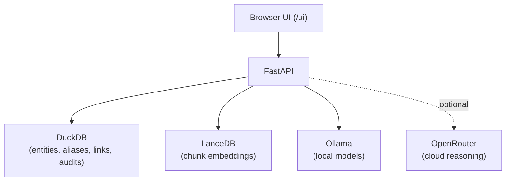

# Operation Lens v2

**Turn a folder of PDFs into a searchable, evidence-backed intelligence graph — entirely on your own machine.**

Operation Lens v2 ingests documents, extracts entities and relationships, and answers
investigator-style questions with every claim validated against a cited source span. By default,
no document content ever leaves the machine.

[View on GitHub](https://github.com/meabs/localsearch){: .btn }

---

## Start here

| If you want to… | Go to |
|---|---|
| Get it running in 5 minutes | [Quickstart](https://github.com/meabs/localsearch#quickstart-5-minutes) |
| Understand how it fits together | [Architecture](architecture.md) |
| Operate a running instance | [Runbook](runbook.md) |
| See UI screenshots | [UI screenshots](screenshots/README.md) |
| Extend it to a new domain | [Extending the system](https://github.com/meabs/localsearch#extending-the-system) |
| Tune settings | [Configuration reference](https://github.com/meabs/localsearch#configuration-reference) |
| Fix something that broke | [Troubleshooting](https://github.com/meabs/localsearch#troubleshooting) |

---

## UI

Two themes ship side-by-side — switch at runtime with the button in the top-right / bottom-right corner.

| Theme | URL | Description |
|---|---|---|
| **New UI** | `/ui/` | Horizontal top-nav, slate-dark `#0d1117`, IBM Plex Sans body, blue `#388bfd` accent |
| **Classic UI** | `/ui/classic.html` | Cinematic amber/space-dark palette, vertical icon sidebar |

Both support hash routing: `/ui/#graph`, `/ui/#query`, `/ui/#map`, `/ui/#timeline`, `/ui/#cases`, `/ui/#audit`.

See [UI screenshots](screenshots/README.md) for a full visual comparison.

---

## What it does

- **Ingestion** — PDFs → text extraction → chunking → NER → alias normalization → relationship
  extraction → DuckDB evidence graph + LanceDB vector index.
- **Query** — question → intent parsing → exact / FTS / vector / graph retrieval → rerank →
  evidence packet → answer generation → claim validation against cited spans.

## Runtime architecture

## Data sovereignty

DuckDB, LanceDB, and Ollama all run on the local machine. Cloud reasoning via OpenRouter is opt-in
and redacts span text before any external call.

---

## Documentation

- [Architecture notes](architecture.md) — data stores and pipeline shape
- [Runbook](runbook.md) — operating notes
- [UI screenshots](screenshots/README.md) — new and classic UI side-by-side
- [Full README on GitHub](https://github.com/meabs/localsearch#readme) — detailed reference

## License

Released under [PolyForm Noncommercial 1.0.0](https://github.com/meabs/localsearch/blob/main/LICENSE).
Commercial use requires a separate written license — see
[COMMERCIAL-LICENSE.md](https://github.com/meabs/localsearch/blob/main/COMMERCIAL-LICENSE.md).
