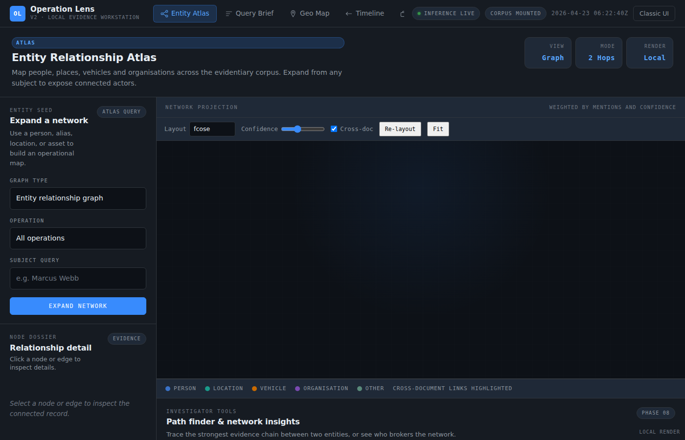
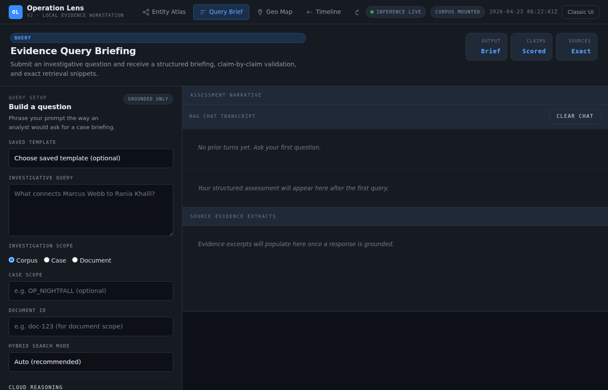
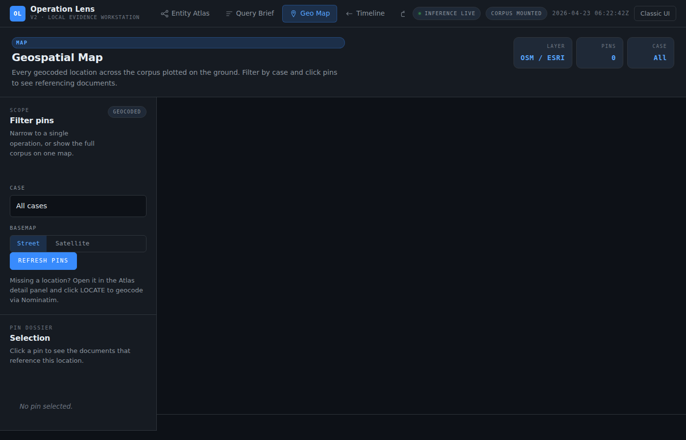
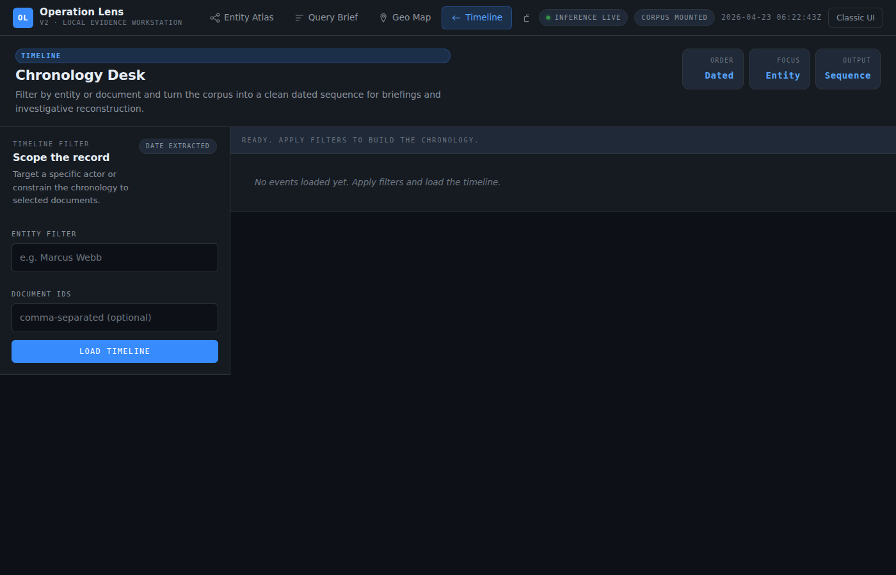
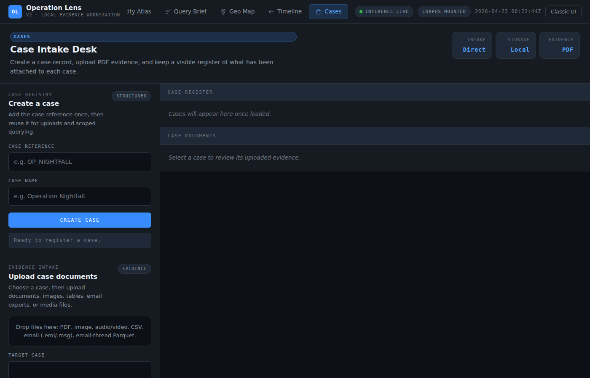
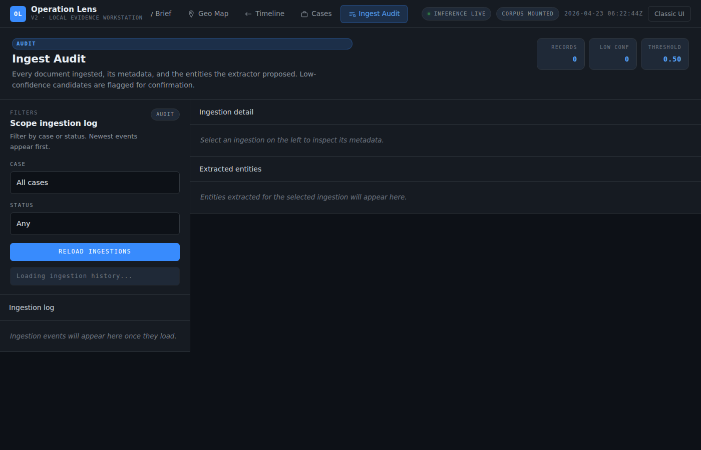
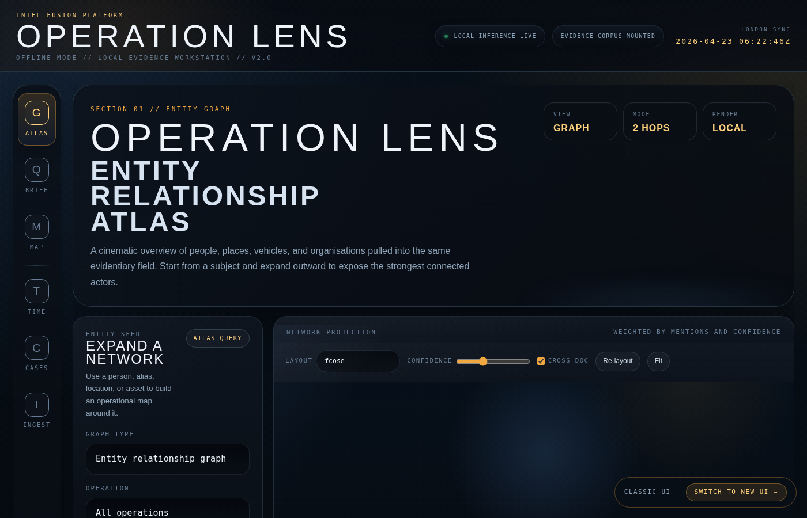
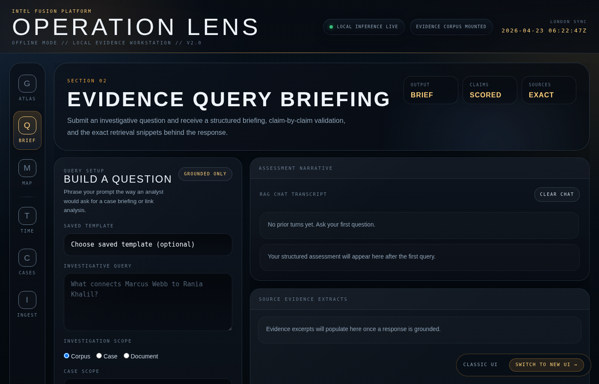
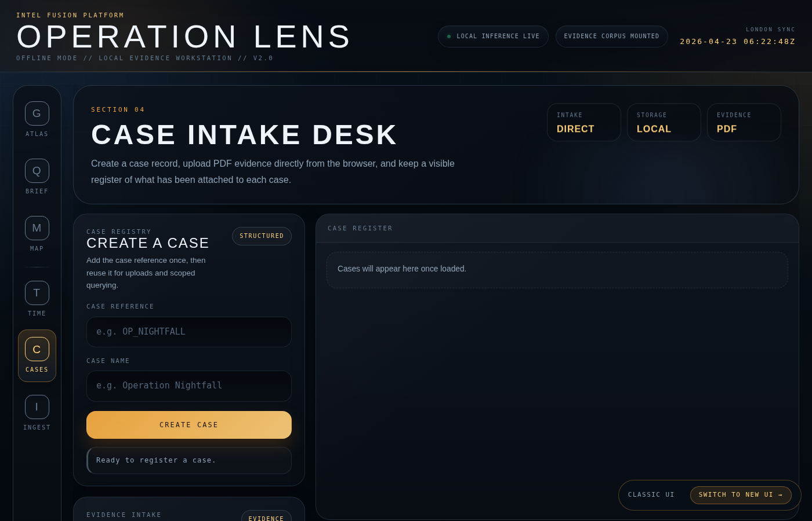

# UI Screenshots

Operation Lens v2 ships two UI themes that can be toggled at runtime — both serve the same FastAPI backend and all JS modules unchanged.

| Path | Theme | Switch link |
|---|---|---|
| `/ui/` (`index.html`) | **New UI** — horizontal top-nav, slate-dark palette | "Classic UI" button (top-right) |
| `/ui/classic.html` | **Classic UI** — cinematic amber/space-dark palette | "Switch to new UI" pill (bottom-right) |

Both UIs support **URL hash routing**: `/ui/#graph`, `/ui/#query`, `/ui/#map`, `/ui/#timeline`, `/ui/#cases`, `/ui/#audit`.

---

## New UI

### Entity Atlas (`#graph`)

Top bar with logo + horizontal nav. Two-column layout: left side panel (seed form, node dossier), right canvas area (layout toolbar, graph canvas, legend, path-finder / centrality / community tools).

### Query Brief (`#query`)

Left: query form with scope / case / document / cloud-reasoning controls. Right: RAG chat transcript + structured assessment + source evidence extracts. Claims validation matrix in the side panel.

### Geo Map (`#map`)

Filter panel with basemap toggle. Full-width Leaflet canvas on the right.

### Timeline (`#timeline`)

Entity / document filter on the left. Full-width event list on the right, newest first.

### Cases (`#cases`)

Create-case and upload forms on the left. Case register + case-document list on the right.

### Ingest Audit (`#audit`)

Filter form + ingestion log on the left. Ingestion detail + entity candidate list on the right.

---

## Classic UI (preserved)

The original cinematic design is unchanged at `/ui/classic.html`.

### Entity Atlas

### Query Brief

### Cases

---

## Design differences

| | New UI | Classic UI |
|---|---|---|
| Navigation | Horizontal top bar | Vertical icon sidebar |
| Palette | Slate `#0d1117`, blue accent `#388bfd` | Space dark `#04080f`, amber accent `#f1a73f` |
| Typography | IBM Plex Sans body, Plex Mono for labels | IBM Plex Mono throughout |
| Page header | Title + description + metric cards | Large cinematic H1 |
| Switch | "Classic UI" button (top-right) | "Switch to New UI" pill (bottom-right) |
| Hash routing | `/ui/#graph` etc. | `/ui/classic.html#graph` etc. |
